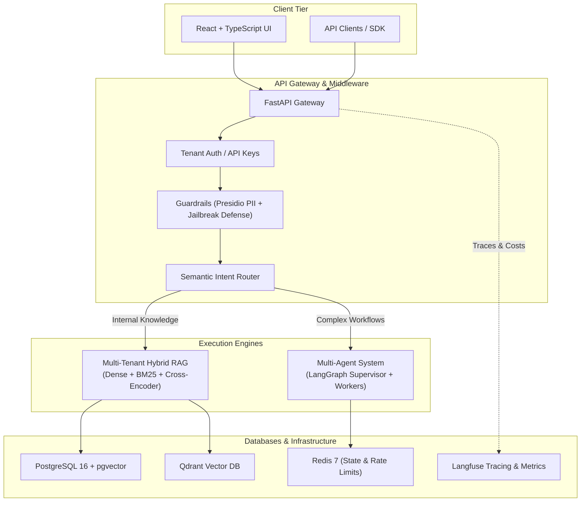

# Enterprise AI Platform

[](https://fastapi.tiangolo.com)
[](https://www.python.org)
[](https://react.dev)
[](https://qdrant.tech)
[](https://langfuse.com)
[](LICENSE)

A production-grade, multi-tenant enterprise AI system featuring isolated Hybrid RAG, LangGraph multi-agent orchestration, PII guardrails, real-time observability, and fine-tuning pipelines.

---

## 🏛️ Core Architecture Pillars



### 1. Enterprise Multi-Tenant RAG
- **Strict Tenant Isolation**: Vector indexing and partition filtering ensuring zero cross-tenant data leakage.
- **Hybrid Retrieval**: Combines Dense vector embeddings with Sparse keyword search (BM25 / `tsvector`) using Reciprocal Rank Fusion (RRF).
- **Cross-Encoder Re-Ranking**: Two-stage retrieval scoring to maximize context precision while minimizing context window cost.

### 2. Multi-Agent Orchestration (LangGraph)
- **Specialized Worker Topology**: Planner, RAG Specialist, Code/SQL Analytics, and Critic/Reviewer nodes.
- **State Persistence**: Redis and PostgreSQL checkpointing for durable long-running workflows.
- **Human-in-the-Loop**: Interactive approval gates before critical actions or external API writes.

### 3. LLM Observability & Guardrails Platform
- **Real-Time Guardrails**: Microsoft Presidio for automated PII anonymization/redaction and prompt injection detection.
- **Observability & Tracing**: Native Langfuse integration tracking tokens, dollar costs, latency, and full execution traces.
- **Multi-Tenant Rate Limiting & Quotas**: Sliding-window rate limiters and monthly token budgets per tenant.

### 4. Continuous Evaluation & Domain Fine-Tuning
- **Evaluation Pipeline**: Automated RAG benchmark assessment (Faithfulness, Answer Relevance, Context Recall) powered by Ragas.
- **Fine-Tuning**: Dataset curation from production traces and parameter-efficient fine-tuning (PEFT / QLoRA) with automatic cloud fallback.

---

## 📂 Project Structure

```text
enterprise-ai-platform/
├── backend/                        # FastAPI Python backend
│   ├── gateway/                    # API routing, auth & middleware
│   ├── knowledge/                  # Ingestion, parsers, hybrid retrieval & rerankers
│   ├── orchestration/              # LangGraph multi-agent nodes & state graphs
│   ├── observability/              # Presidio guardrails, telemetry & Langfuse integration
│   ├── pyproject.toml              # PEP 621 dependencies (uv-managed)
│   └── .venv/                      # Python virtual environment
├── frontend/                       # Vite + React + TypeScript web app
│   ├── src/                        # UI components, state & API clients
│   └── package.json
├── docker-compose.yml              # Local infrastructure container stack
├── init-db.sql                     # Postgres database & pgvector initialization
├── .env.example                    # Environment variable template
└── README.md
```

---

## 🛠️ Technology Stack

| Layer | Technologies |
| :--- | :--- |
| **Backend** | Python 3.12, FastAPI, Pydantic v2, SQLAlchemy (asyncio), AsyncPG |
| **Package Management** | `uv` / PEP 621 `pyproject.toml` |
| **Databases** | PostgreSQL 16 (`pgvector`), Qdrant Vector DB, Redis 7 (Alpine) |
| **Agents & RAG** | LangGraph, LangChain, Sentence-Transformers, PyPDF |
| **Security & Guardrails** | Microsoft Presidio (Analyzer & Anonymizer), Custom Jailbreak Classifiers |
| **Observability** | Langfuse, RedisInsight, Prometheus |
| **Frontend** | React 19, TypeScript, Vite, Tailwind CSS / Vanilla CSS |

---

## 🚀 Getting Started

### Prerequisites
- **Docker Desktop** installed and running.
- **Python 3.11+** installed.
- **uv** (recommended) or standard `pip`.
- **Node.js 18+** for the frontend.

---

### Step 1: Clone and Configure Environment

```bash
# Clone the repository
git clone https://github.com/sinuarlowbaby/enterprise-ai-platform.git
cd enterprise-ai-platform

# Create local .env file from template
cp .env.example .env
```

Review [`.env`](.env) and customize keys if necessary.

---

### Step 2: Spin Up Infrastructure Containers

Ensure Docker Desktop is open, then run:

```bash
docker compose up -d
```

Verify that all containers are healthy:
```bash
docker compose ps
```

#### Available Services & Consoles

| Service | Address | Credentials / Info |
| :--- | :--- | :--- |
| **Qdrant Dashboard** | [http://localhost:6333/dashboard](http://localhost:6333/dashboard) | Web UI for vector collections |
| **RedisInsight** | [http://localhost:5540](http://localhost:5540) | Redis GUI (Host: `redis`, Port: `6379`, Pass: `redispassword`) |
| **Langfuse UI** | [http://localhost:3000](http://localhost:3000) | Tracing, evaluations & cost monitoring |
| **PostgreSQL** | `localhost:5432` | User: `postgres`, Pass: `postgres`, DB: `app_db` |

---

### Step 3: Set Up Backend

```bash
cd backend

# Create virtual environment (if not already created)
uv venv

# Activate virtual environment
# On Windows (PowerShell):
.venv\Scripts\Activate.ps1
# On Windows (CMD):
.venv\Scripts\activate.bat
# On Linux/macOS:
source .venv/bin/activate

# Install dependencies in editable mode
uv pip install -e .

# (Optional) Include dev packages:
uv pip install -e ".[dev]"
```

Start the backend development server:

```bash
uvicorn gateway.middleware.main:app --reload --port 8000
```

FastAPI Interactive Documentation is now live at:
- Swagger UI: [http://localhost:8000/docs](http://localhost:8000/docs)
- ReDoc: [http://localhost:8000/redoc](http://localhost:8000/redoc)

---

### Step 4: Set Up Frontend

```bash
cd ../frontend

# Install dependencies
npm install

# Start Vite development server
npm run dev
```

The frontend dashboard will be available at [http://localhost:5173](http://localhost:5173).

---

## 🗺️ Roadmap & Milestones

- [x] **Phase 0: Infrastructure & Core Scaffold** (PostgreSQL/pgvector, Qdrant, Redis, Langfuse, `pyproject.toml`)
- [ ] **Phase 1: Multi-Tenant Hybrid RAG Engine** (Parsers, Chunking, Dense + BM25, Cross-Encoder Re-ranking)
- [ ] **Phase 2: Guardrails & Query Router** (Presidio PII Anonymizer, Jailbreak Shield, Semantic Intent Router)
- [ ] **Phase 3: Multi-Agent Orchestration** (LangGraph Planner, Worker Nodes, Checkpointing & HITL)
- [ ] **Phase 4: Telemetry & Continuous Evaluation** (Langfuse integration, Token/Cost accounting, Ragas evals)
- [ ] **Phase 5: Fine-Tuning Pipeline** (Dataset curation from production logs, QLoRA fine-tuning, Cloud fallback)
- [ ] **Phase 6: Auth, Quotas & Dashboard UI** (API Key management, Sliding window rate limiter, React frontend)

---

## 📄 License
This project is licensed under the MIT License - see the [LICENSE](LICENSE) file for details.
