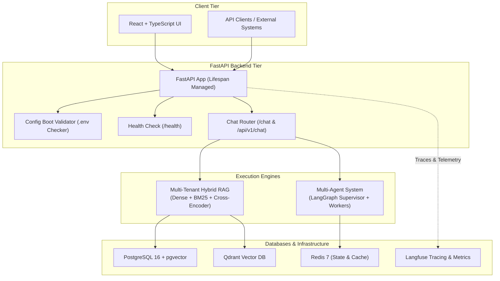

# 🌐 Enterprise AI Platform

[](https://www.python.org)
[](https://fastapi.tiangolo.com)
[](https://docs.astral.sh/uv/)
[](https://www.docker.com)
[](https://qdrant.tech)
[](https://github.com/pgvector/pgvector)
[](https://redis.io)
[](https://langfuse.com)
[](LICENSE)

A production-grade, multi-tenant enterprise AI system featuring isolated Hybrid RAG, multi-agent orchestration, PII guardrails, real-time observability, and fine-tuning pipelines.

---

## 🏛️ System Architecture



---

## 🚀 Key Features

- **FastAPI Core with Async Lifespan**: Structured startup verification and graceful connection shutdown.
- **Fail-Fast Boot Protection**: Halts system startup with diagnostic errors if `.env` or required configurations are missing.
- **Operational Health Endpoint**: Standardized `/health` endpoint for Kubernetes probes and load balancers.
- **Chat Subsystem**: Modular chat routing mounted at `/chat` and `/api/v1/chat` with structured Pydantic schemas.
- **Blazing Fast `uv` Toolchain**: Instant dependency resolution, lockfile synchronization, and Python 3.12 environment management.
- **Full Infrastructure Stack**: Containerized PostgreSQL 16 (`pgvector`), Qdrant, Redis 7, RedisInsight, and Langfuse.

---

## 📂 Project Structure

```text
enterprise-ai-platform/
├── backend/
│   ├── app/
│   │   ├── core/
│   │   │   ├── __init__.py
│   │   │   └── config.py              # Strict environment boot verification & Settings
│   │   ├── routers/
│   │   │   ├── __init__.py
│   │   │   └── chat.py                # Chat router (GET /status, POST /)
│   │   ├── router/                    # Compatibility alias for app.router
│   │   │   ├── __init__.py
│   │   │   └── chat.py
│   │   ├── __init__.py
│   │   └── main.py                    # FastAPI entrypoint, lifespan & /health
│   ├── tests/
│   │   ├── test_app.py                # Health, chat & lifespan tests
│   │   └── test_config.py             # Boot halt & configuration validation tests
│   ├── pyproject.toml                 # Modern PEP 621 dependencies managed by uv
│   └── README.md
├── docker-compose.yml                  # Infrastructure services (Postgres, Qdrant, Redis, Langfuse)
├── .env.example                       # Environment variables template
├── .env                               # Active configuration file
└── README.md                          # Primary platform documentation
```

---

## 🛠️ Getting Started

### Prerequisites

- **Python 3.12**
- **[uv](https://docs.astral.sh/uv/)** package manager:
  ```powershell
  # Install uv on Windows
  powershell -ExecutionPolicy ByPass -c "irm https://astral.sh/uv/install.ps1 | iex"
  ```
- **Docker Desktop** (for storage and observability containers)

---

### Step 1: Environment Configuration

```bash
# Clone the repository
git clone https://github.com/sinuarlowbaby/enterprise-ai-platform.git
cd enterprise-ai-platform

# Copy environment template if .env does not exist
cp .env.example .env
```

> [!IMPORTANT]
> The backend verifies the existence of `.env` on boot. If `.env` or critical environment variables (`DATABASE_URL`, `REDIS_URL`, `POSTGRES_DB`) are missing, the server will intentionally halt startup with a diagnostic error.

---

### Step 2: Spin Up Infrastructure Containers

Ensure Docker Desktop is running, then start the container stack:

```bash
docker compose up -d
```

Verify container status:
```bash
docker compose ps
```

| Service | Address | Notes |
| :--- | :--- | :--- |
| **PostgreSQL 16** | `localhost:5432` | Relational & pgvector storage (`app_db`) |
| **Qdrant Vector DB** | [http://localhost:6333/dashboard](http://localhost:6333/dashboard) | Dedicated vector engine & Web UI |
| **Redis 7** | `localhost:6379` | Agent checkpointing & caching |
| **RedisInsight** | [http://localhost:5540](http://localhost:5540) | Redis visual management UI |
| **Langfuse** | [http://localhost:3000](http://localhost:3000) | Observability, traces & cost tracking |

---

### Step 3: Backend Setup with `uv` (Python 3.12)

Navigate to the `backend/` directory:

```bash
cd backend
```

#### 1. Create Python 3.12 Virtual Environment

```powershell
uv venv --python 3.12 .venv
```

#### 2. Activate Virtual Environment

- **Windows PowerShell**:
  ```powershell
  .venv\Scripts\Activate.ps1
  ```
- **Windows CMD**:
  ```cmd
  .venv\Scripts\activate.bat
  ```
- **Linux / macOS**:
  ```bash
  source .venv/bin/activate
  ```

#### 3. Install Dependencies

Using `uv sync`:
```powershell
uv sync --all-extras
```

Or using `uv pip`:
```powershell
uv pip install -e ".[dev]"
```

---

### Step 4: Run Development Server

```powershell
# Run with hot reload enabled
uv run uvicorn app.main:app --reload --host 0.0.0.0 --port 8000
```

Once running, access the interactive API docs:
- **Swagger UI**: [http://localhost:8000/docs](http://localhost:8000/docs)
- **ReDoc**: [http://localhost:8000/redoc](http://localhost:8000/redoc)
- **Health Check**: [http://localhost:8000/health](http://localhost:8000/health)

---

### Step 5: Run Automated Tests

Execute the test suite to verify configuration checks, router endpoints, and lifespan execution:

```powershell
uv run pytest -v
```

---

## 📡 Core API Endpoints

### 1. System Health
```http
GET /health
```
**Response:**
```json
{
  "status": "healthy",
  "service": "Enterprise AI Platform",
  "environment": "development",
  "version": "0.1.0",
  "timestamp": "2026-09-24T00:00:00.000000+00:00"
}
```

### 2. Chat Service Status
```http
GET /chat/status
```
**Response:**
```json
{
  "service": "chat",
  "status": "ready",
  "timestamp": "2026-09-24T00:00:00.000000+00:00"
}
```

### 3. Send Chat Query
```http
POST /chat
Content-Type: application/json

{
  "message": "Hello, is the Enterprise AI system online?",
  "conversation_id": "session-001"
}
```
**Response:**
```json
{
  "conversation_id": "session-001",
  "reply": "Echo / Acknowledged: 'Hello, is the Enterprise AI system online?'. Enterprise AI chat service is operational.",
  "timestamp": "2026-09-24T00:00:00.000000+00:00",
  "status": "success"
}
```

---

## 📄 License

This project is licensed under the MIT License - see the [LICENSE](LICENSE) file for details.
