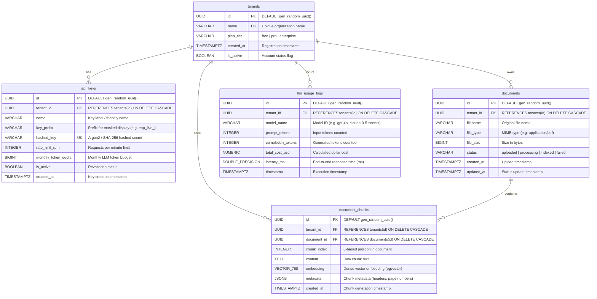

# Enterprise AI Platform - PostgreSQL Database Schema

This document details the PostgreSQL 16 relational and vector database schema for the Enterprise AI Platform.

---

## Architecture Overview

The platform uses PostgreSQL with the **`pgvector`** extension (`vector`) and **`uuid-ossp`** extension to provide strict multi-tenant isolation, Hybrid RAG vector search, API key authorization, and LLM telemetry.



---

## Tables and Columns Reference

### 1. `tenants`
The root organizational entity. All tenant data is strictly partitioned by `tenant_id`.

| Column | Type | Constraints / Defaults | Description |
| :--- | :--- | :--- | :--- |
| `id` | `UUID` | `PRIMARY KEY`, `DEFAULT gen_random_uuid()` | Unique tenant identifier |
| `name` | `VARCHAR(255)` | `NOT NULL`, `UNIQUE`, Indexed | Organization or customer name |
| `plan_tier` | `VARCHAR(50)` | `NOT NULL`, `DEFAULT 'free'` | Pricing tier (`free`, `pro`, `enterprise`) |
| `created_at` | `TIMESTAMPTZ` | `NOT NULL`, `DEFAULT now()` | Account creation timestamp |
| `is_active` | `BOOLEAN` | `NOT NULL`, `DEFAULT true` | Account active / suspended flag |

---

### 2. `api_keys`
API credentials for authenticating requests and enforcing rate limits and monthly quotas.

| Column | Type | Constraints / Defaults | Description |
| :--- | :--- | :--- | :--- |
| `id` | `UUID` | `PRIMARY KEY`, `DEFAULT gen_random_uuid()` | Unique key identifier |
| `tenant_id` | `UUID` | `NOT NULL`, `REFERENCES tenants(id) ON DELETE CASCADE`, Indexed | Owner tenant organization |
| `name` | `VARCHAR(100)` | `NULL` | Optional friendly name / description |
| `key_prefix` | `VARCHAR(16)` | `NULL` | Plaintext prefix for UI identification |
| `hashed_key` | `VARCHAR(255)` | `NOT NULL`, `UNIQUE`, Indexed | Secure cryptographic hash of the secret |
| `rate_limit_rpm` | `INTEGER` | `NOT NULL`, `DEFAULT 60` | Maximum requests per minute allowed |
| `monthly_token_quota` | `BIGINT` | `NOT NULL`, `DEFAULT 1000000` | Monthly maximum token allocation |
| `is_active` | `BOOLEAN` | `NOT NULL`, `DEFAULT true` | Key enabled/revoked state |
| `created_at` | `TIMESTAMPTZ` | `NOT NULL`, `DEFAULT now()` | Creation timestamp |

---

### 3. `documents`
Uploaded knowledge files and ingestion pipeline status.

| Column | Type | Constraints / Defaults | Description |
| :--- | :--- | :--- | :--- |
| `id` | `UUID` | `PRIMARY KEY`, `DEFAULT gen_random_uuid()` | Unique document identifier |
| `tenant_id` | `UUID` | `NOT NULL`, `REFERENCES tenants(id) ON DELETE CASCADE`, Indexed | Document owner tenant |
| `filename` | `VARCHAR(255)` | `NOT NULL` | Original filename |
| `file_type` | `VARCHAR(100)` | `NOT NULL` | MIME type (e.g. `application/pdf`, `text/markdown`) |
| `file_size` | `BIGINT` | `NOT NULL` | File size in bytes |
| `status` | `VARCHAR(50)` | `NOT NULL`, `DEFAULT 'uploaded'`, Indexed | Processing status (`uploaded`, `processing`, `indexed`, `failed`) |
| `created_at` | `TIMESTAMPTZ` | `NOT NULL`, `DEFAULT now()` | Upload timestamp |
| `updated_at` | `TIMESTAMPTZ` | `NOT NULL`, `DEFAULT now()` | Last update timestamp |

---

### 4. `document_chunks`
Segmented text passages with dense vector representations and arbitrary JSONB metadata.

| Column | Type | Constraints / Defaults | Description |
| :--- | :--- | :--- | :--- |
| `id` | `UUID` | `PRIMARY KEY`, `DEFAULT gen_random_uuid()` | Unique chunk identifier |
| `tenant_id` | `UUID` | `NOT NULL`, `REFERENCES tenants(id) ON DELETE CASCADE`, Indexed | Tenant isolation filter |
| `document_id` | `UUID` | `NOT NULL`, `REFERENCES documents(id) ON DELETE CASCADE`, Indexed | Parent document reference |
| `chunk_index` | `INTEGER` | `NOT NULL` | Sequence order index |
| `content` | `TEXT` | `NOT NULL` | Passage text content |
| `embedding` | `VECTOR(768)` | `NULL`, HNSW Index | 768-dimensional dense vector (`nomic-ai/nomic-embed-text-v1.5`) |
| `metadata` | `JSONB` | `NOT NULL`, `DEFAULT '{}'::jsonb`, GIN Index | Passage metadata (headers, page, coordinates) |
| `created_at` | `TIMESTAMPTZ` | `NOT NULL`, `DEFAULT now()` | Chunk generation timestamp |

#### Specialized Indexes
- **Multi-Tenant Partition Filtering Index (B-Tree)**:
  ```sql
  CREATE INDEX ix_document_chunks_tenant_id
  ON document_chunks USING btree (tenant_id);
  ```
- **Vector Semantic Search Index (HNSW)**:
  ```sql
  CREATE INDEX ix_document_chunks_embedding_hnsw
  ON document_chunks USING hnsw (embedding vector_cosine_ops)
  WITH (m = 16, ef_construction = 64);
  ```
- **Metadata Filtering Index (GIN)**:
  ```sql
  CREATE INDEX ix_document_chunks_metadata_gin
  ON document_chunks USING gin (metadata);
  ```

---

### 5. `llm_usage_logs`
Fine-grained telemetry tracking token usage, latency, and cost for observability and billing.

| Column | Type | Constraints / Defaults | Description |
| :--- | :--- | :--- | :--- |
| `id` | `UUID` | `PRIMARY KEY`, `DEFAULT gen_random_uuid()` | Unique log event identifier |
| `tenant_id` | `UUID` | `NOT NULL`, `REFERENCES tenants(id) ON DELETE CASCADE`, Indexed | Tenant incurring the inference call |
| `model_name` | `VARCHAR(100)` | `NOT NULL`, Indexed | Model identifier (e.g. `gpt-4o`) |
| `prompt_tokens` | `INTEGER` | `NOT NULL`, `DEFAULT 0` | Input token count |
| `completion_tokens` | `INTEGER` | `NOT NULL`, `DEFAULT 0` | Output/generation token count |
| `total_cost_usd` | `NUMERIC(10, 6)`| `NOT NULL`, `DEFAULT 0.000000` | Estimated cost in USD |
| `latency_ms` | `DOUBLE PRECISION`| `NOT NULL`, `DEFAULT 0.0` | Call duration in milliseconds |
| `timestamp` | `TIMESTAMPTZ` | `NOT NULL`, `DEFAULT now()`, Indexed | Inference completion timestamp |

#### Composite Query Index
```sql
CREATE INDEX ix_llm_usage_logs_tenant_timestamp
ON llm_usage_logs (tenant_id, timestamp);
```

---

## Migration & Initialization Instructions

### Running with Docker Compose
On initial boot, `init-db.sql` automatically runs inside the `postgres` container:
```bash
docker compose up -d postgres
```

### Running Alembic Migrations
```bash
# Apply migrations to head
cd backend
alembic upgrade head

# Generate raw SQL without connecting to database (offline mode)
alembic upgrade head --sql
```
